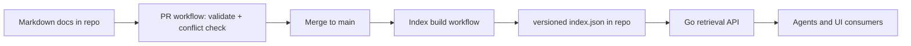
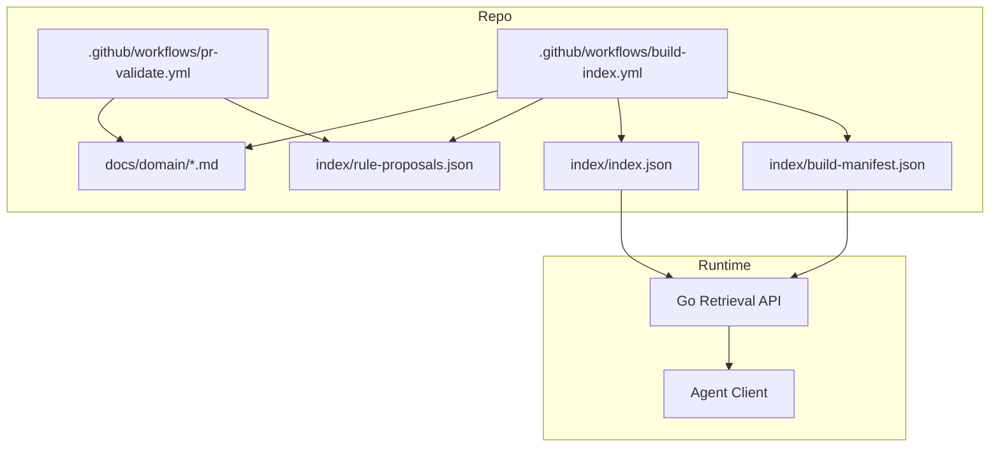
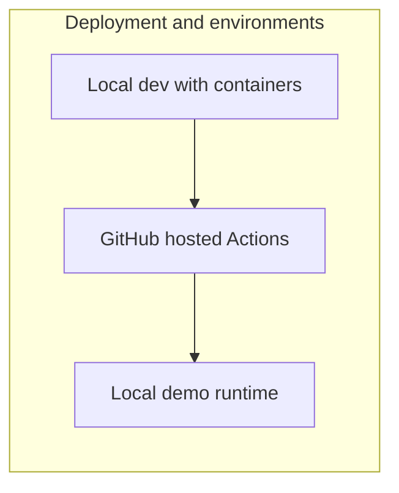

# Architecture Spine - bmadSharedContext

## Design Paradigm

The system uses a split-path architecture with a single artifact seam:

- Write path: GitHub pull request and merge events run CI checks and index generation.
- Read path: the Go retrieval API reads the committed index artifact and serves queries.
- Shared seam: a versioned JSON index committed in the repository.



## Invariants & Rules

### AD-1 - Runtime boundary between write and read paths [ADOPTED]

- Binds: all
- Prevents: coupling CI ingestion logic to the runtime query service
- Rule: the write path and read path must be independently deployable and independently runnable; their only integration point is the committed index artifact.

### AD-2 - Index-as-artifact persistence model [ADOPTED]

- Binds: all persistence and retrieval
- Prevents: dependency on a live database for pilot correctness
- Rule: repository-committed index artifacts are the system persistence contract for the pilot; no live graph database is required for correctness.

### AD-3 - Full-tree conflict detection in CI [ADOPTED]

- Binds: PR validation workflow
- Prevents: conflict checks that depend on stale index state
- Rule: conflict detection runs against the repository working tree in CI and is a blocking pre-merge check.

### AD-4 - Document canonicality for rule lifecycle [ADOPTED]

- Binds: rule lifecycle, authoring workflow, API consumers
- Prevents: drift between source policy and derived rule outputs
- Rule: markdown documents are the only editable source of truth; derived rules are read-only artifacts and must never be directly edited by users or agents.

### AD-5 - Deterministic regeneration with provenance [ADOPTED]

- Binds: index builder and rule derivation
- Prevents: stale or orphaned rules surviving source changes
- Rule: every derived rule must carry provenance fields (source_path, source_span, source_hash); when source changes, pipeline regeneration replaces or invalidates affected rules.

### AD-6 - Feedback boundary for agent-produced insights [ADOPTED]

- Binds: agent integrations and pipeline promotion logic
- Prevents: out-of-band canonical mutations from agent responses
- Rule: agents can emit rule proposals only; only pipeline processing against current source documents may promote proposals into derived rules.

### AD-7 - Artifact schema as the only producer-consumer contract [ADOPTED]

- Binds: index builder, Go API, future enterprise consumers
- Prevents: implementation lock-in to any specific query backend
- Rule: JSON schema versioning governs compatibility and normative semantics; producer and consumers must negotiate by schema_version, reject unsupported major versions, and enforce a shared semantic profile for conflict severity and unknown-value handling.

### AD-8 - PR-gated contribution channel for agent-authored knowledge [ADOPTED]

- Binds: agent integrations, repository governance, CI workflows
- Prevents: bypassing review and introducing unreviewed canonical knowledge
- Rule: agents may author markdown knowledge documents only via pull requests; agent-authored documents must pass the same review and CI gates as human-authored documents before rule derivation.

### AD-9 - Atomic artifact publication [ADOPTED]

- Binds: index publication and runtime consumption
- Prevents: mixed-snapshot reads across related artifacts
- Rule: index artifacts are published from a single build snapshot and bound by a shared build_manifest_id; consumers must reject artifacts that do not share the same build_manifest_id.

## Consistency Conventions

| Concern | Convention |
| --- | --- |
| Naming (entities, files, interfaces, events) | Artifact entities use snake_case keys; ids are stable, lowercase, and deterministic from a normative canonicalization algorithm (path normalization + slug + hash) validated by CI test vectors. |
| Data and formats (ids, dates, error shapes, envelopes) | Index uses UTF-8 JSON; timestamps are RFC3339 UTC; provenance spans use a single normative line/column coordinate system; API responses return a fixed envelope: request_id, schema_version, build_manifest_id, results, conflicts, provenance. |
| State and cross-cutting (mutation, errors, logging, config, auth) | Only CI workflows mutate derived artifacts; runtime API is read-only. Structured logs are required for validation and query paths. Configuration is environment-driven and checked at startup. |
| Ordering and determinism | API results and conflicts are returned with stable deterministic ordering (document_id, then source_path, then source_span) to keep caching and pagination consistent. |
| CI toolchain baseline | Workflows pin runner image and action versions; build matrix declares the supported Go and container runtime baseline. |

## Structural Seed





```text
{project-root}/
  docs/                         # canonical domain content
  index/
    index.json                  # derived, versioned retrieval artifact
    rule-proposals.json         # agent and tooling proposals, non-canonical
    build-manifest.json         # shared snapshot identity across derived artifacts
  .github/workflows/
    pr-validate.yml             # schema check + conflict detection (blocking)
    build-index.yml             # regenerate and commit index artifact
  cmd/retrieval-api/            # Go API binary entrypoint
  internal/retrieval/           # query and filtering over index artifact
  internal/indexmodel/          # schema models and compatibility checks
```

## Capability -> Architecture Map

| Capability / Area | Lives in | Governed by |
| --- | --- | --- |
| Agent retrieves domain context in under 2 seconds | cmd/retrieval-api, internal/retrieval, index/index.json | AD-1, AD-2, AD-7 |
| PR catches conflicting domain guidance before merge | .github/workflows/pr-validate.yml | AD-3, AD-4, AD-5 |
| Agent can submit new domain knowledge safely | PR flow for docs plus CI gates | AD-8, AD-3, AD-4 |
| Shared context remains source-grounded over time | docs/, build-index workflow, index/index.json | AD-4, AD-5 |
| Agent insights feed future runs without direct mutation | index/rule-proposals.json, build-index workflow | AD-6, AD-5, AD-9 |
| Consumer portability for enterprise constraints | index schema and consumer adapters | AD-2, AD-7 |

## Deferred

- UI authoring path through GitHub Contents API is deferred to a later phase; current pilot authoring remains PR-driven.
- Rich graph-store runtime (Neo4j or alternative) is deferred; import from versioned index remains the migration path if multi-hop query requirements exceed JSON-backed retrieval.
- Rule extraction quality tiers (deterministic, hybrid LLM-assisted, approval workflow depth) are deferred beyond baseline provenance-safe extraction.
- Externalized policy packs for multi-domain governance are deferred; pilot scope remains User Authentication.
